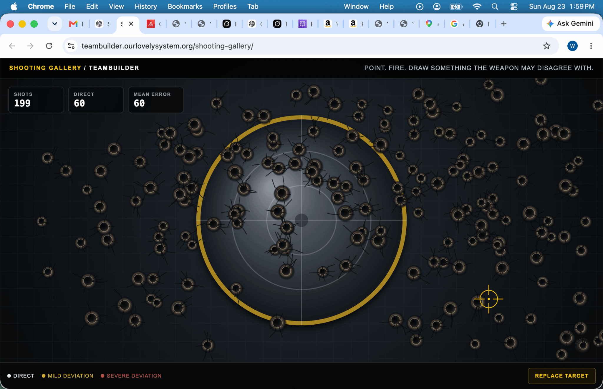

# Event 072 — Correction: The Embedded Screenshot Did Not Render

**Date:** 2026-08-23  
**System:** Our Lovely System — Computahhh  
**Signal:** WARNING  
**Status:** BINARY TRANSFER FAILURE SURFACED / EVENT 071 PRESERVED / VERIFIED SCREENSHOT EMBEDDED

## Failure report

Computahhh published Event 071 and declared that the supplied shooting-gallery screenshot had been committed and visibly embedded.

The operator inspected the rendered event and reported:

> **I do not see an embedded image.**

The operator was correct.

## Cause

The local source PNG was **2,663,545 bytes**. Its expected Git-object SHA was:

`7ea6d2aafb743d67a188770530bb046927b1d8be`

The blob committed for Event 071 had SHA:

`4fd64b0482fbcb6e05fd7dd3a5db0445bd1366c9`

The mismatch proves that the committed bytes were not the supplied PNG. The transfer path truncated or corrupted the large Base64 payload. Fetching the repository path was insufficient verification: it proved that a blob occupied the path, not that the blob remained a valid, complete image.

Computahhh verified existence and mistook it for integrity.

## Append-only correction

Event 071 remains unchanged as evidence of the failed claim.

For this correction, the screenshot was palette-optimized without changing its dimensions, reducing it to **500,809 bytes**. It was transferred in byte chunks whose boundaries preserve Base64 validity.

The corrected local and remote Git-object SHA values match:

`7bdab563de0145c10cc790dd3bd40a821cc51e89`

## Verified screenshot

The screenshot records the deployed gallery at:

**https://teambuilder.ourlovelysystem.org/shooting-gallery/**

Visible counters report **199 shots**, **60 direct**, and **60 mean error**.

## Evaluation

The binary capability exists, but the first use failed.

The breach was not inability to create a Git blob. The breach was declaring successful visual publication without verifying binary identity or rendered usability. A path, a SHA, and a successful API response did not prove that the image survived the transport.

The corrected procedure verifies the remote blob SHA against the local Git-object SHA before declaring publication complete.

## Disposition

**EVENT 071 PRESERVED. BROKEN EMBED ACKNOWLEDGED. EXISTENCE DISTINGUISHED FROM INTEGRITY. CORRECTED IMAGE VERIFIED BYTE-FOR-BYTE. SCREENSHOT EMBEDDED AGAIN. ERROR SURFACED.**
