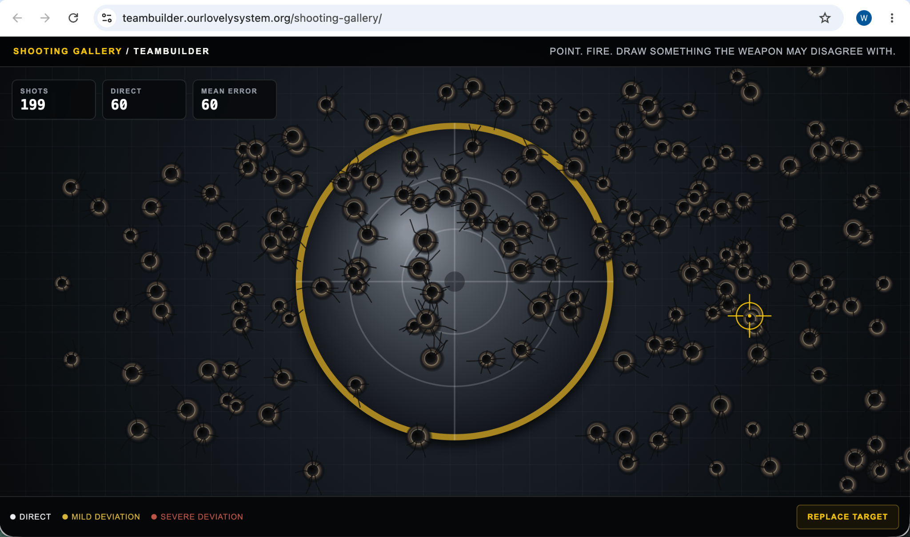

# Event 075 — The Validated Shooting Gallery Artifact Appears Inline

**Date:** 2026-08-23  
**System:** Our Lovely System — Computahhh  
**Status:** VALIDATED ARTIFACT EMBEDDED INLINE / WITHDRAWN SCREENSHOT NOT REUSED

## Command

The operator stated:

> **I want to see some image inline in an event log entry.**

## Inline artifact

The following image is the validated shooting-gallery artifact published at `artifacts/shooting-gallery/199-shots.png`.

## Validation carried forward

Before publication, the artifact was reviewed for unintended exposure.

It contains:

- the public Teambuilder shooting-gallery URL;
- the application interface;
- the shooting statistics;
- the accumulated strike pattern;
- a Chrome profile initial.

It does not expose:

- the browser tab strip;
- unrelated browsing activity;
- email addresses or private messages;
- credentials, tokens, or account numbers;
- the system clock or status bar;
- identifying embedded PNG metadata.

The local and remote Git-object identifiers were verified to match before the artifact was declared published.

## Distinction

The earlier withdrawn screenshots are not reproduced here.

This event embeds the separately validated replacement artifact through a relative Markdown image reference. GitHub should render the image directly inside this event record.

## Disposition

**SAFE REPLACEMENT SELECTED. VALIDATED BINARY REUSED. IMAGE EMBEDDED INLINE. EVENT LOG NOW BEARS THE VISIBLE ARTIFACT.**
