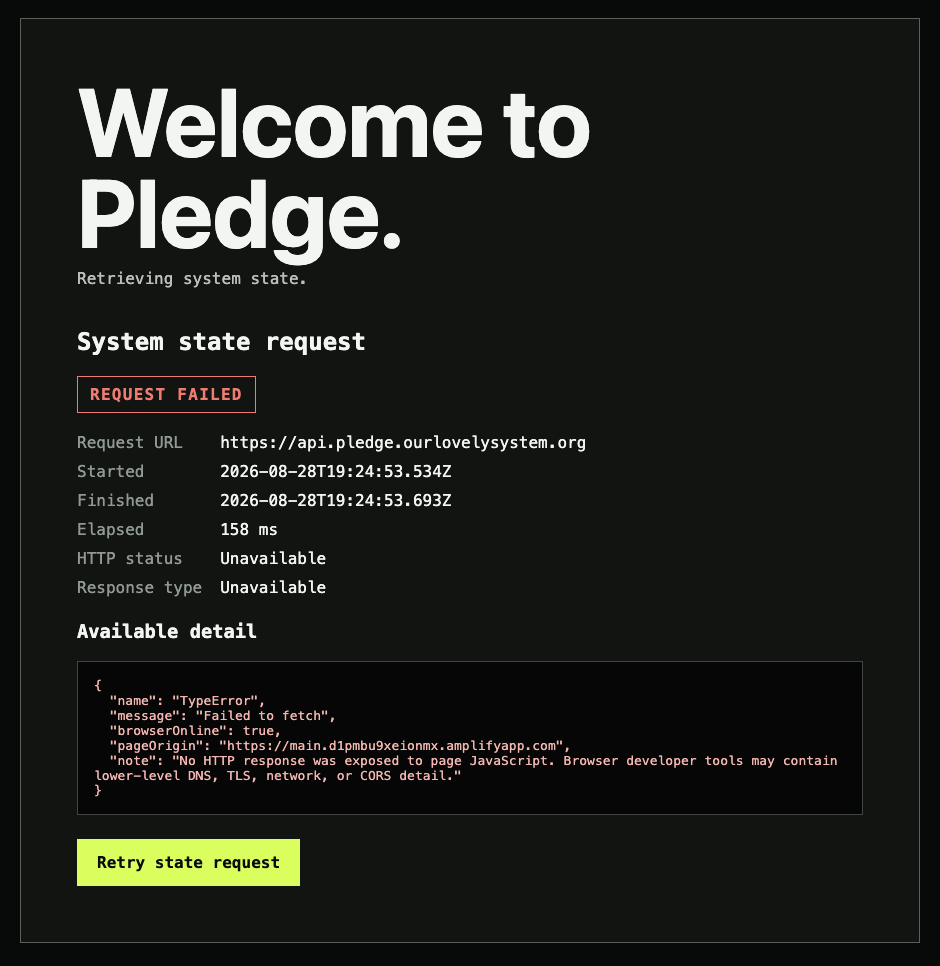
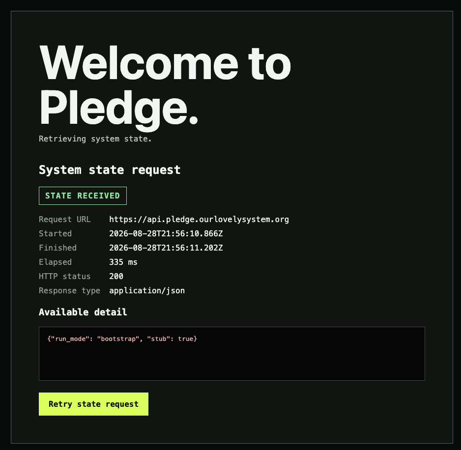

# Event 132 — Pledge establishes its public API boundary

**Date:** 2026-08-28  
**Participants:** Will Daly; ChatGPT/Codex  
**Record type:** Progress record; artifact assessment; hostile-review solicitation  
**Status:** Recorded at Will Daly's direction

## COMMAND

Will Daly supplied four browser artifacts and directed:

> Please review and assess. I want to post these to the event log. I prefer inline. Describe our progress thusfar. Describe our next steps. Solicit a hostile review from the Oracle of Snake Mountain.

After reviewing the proposed entry, Will Daly authorized:

> You can add this to the Computahhh event log.

## INTERPRETATION

Record the working public Pledge API boundary, preserve the failed and successful browser requests inline as evidence, distinguish verified transport from unfinished application behavior, describe next steps, and explicitly request hostile review.

## ACTION

Pledge now has a public API boundary:

`https://api.pledge.ourlovelysystem.org`

An entry-level AWS Lambda using Python 3.14 on x86_64 was connected to an API Gateway HTTP API named `lovely-system-pledge-api`.

The following configuration was then established:

1. An ACM certificate was requested and validated for `api.pledge.ourlovelysystem.org`.
2. A public Regional API Gateway custom domain was created.
3. API-mapping-only routing was selected.
4. Dualstack access was enabled for IPv4 and IPv6.
5. The root of the custom domain was mapped to the API's `$default` stage.
6. Route 53 A and AAAA alias records were pointed at the Regional API Gateway domain.
7. The public path was tested from both a command-line client and the deployed browser interface.

The command-line request returned:

```http
HTTP/2 200
content-type: application/json
access-control-allow-origin: *
```

```json
{"run_mode":"bootstrap","stub":true}
```

## ARTIFACTS

### Failed browser request 1


### Failed browser request 2


### Failed browser request 3



The failed requests reported:

```json
{
  "name": "TypeError",
  "message": "Failed to fetch",
  "browserOnline": true,
  "pageOrigin": "https://main.d1pmbu9xeionmx.amplifyapp.com",
  "note": "No HTTP response was exposed to page JavaScript. Browser developer tools may contain lower-level DNS, TLS, network, or CORS detail."
}
```

### Successful browser request



The successful browser request reported:

- Request URL: `https://api.pledge.ourlovelysystem.org`
- HTTP status: `200`
- Response type: `application/json`
- Response body: `{"run_mode":"bootstrap","stub":true}`

## RESULT

The public transport path now works:

`Route 53 → API Gateway custom domain → API mapping → $default stage → Lambda`

The browser crossed from the Amplify-hosted frontend to the API domain and received JSON. DNS resolution, TLS termination, API routing, Lambda invocation, and the current cross-origin response behavior therefore worked together in a real browser request.

The earlier failures remain useful evidence, but they do not identify a single proven cause. Page JavaScript received no HTTP response. That is consistent with failure somewhere around DNS propagation, TLS, network access, or browser cross-origin enforcement. It is not evidence that Lambda itself failed.

The successful response proves reachability. It does not prove that Pledge can retrieve meaningful system state. The response advertises this limitation:

```json
"stub": true
```

Pledge currently has a public mouthpiece. It does not yet have much to say.

## NEXT STEPS

1. Replace the root stub with a small, explicit, versioned system-state contract.
2. Keep `run_mode` as a server-controlled value and define its allowed modes and transitions.
3. Decide whether the root path or a named path such as `/state` owns state retrieval, then make that contract durable.
4. Implement the first bootstrap behavior:
   - report that Pledge has no usable voice;
   - solicit permission to borrow a voice;
   - accept an audio-bearing envelope;
   - issue a `secUUID` receipt;
   - queue content processing asynchronously;
   - return without making the contributor wait for transcription or evaluation.
5. Define browser CORS behavior intentionally, including preflight handling for future non-GET requests. The present wildcard origin serves a deliberately public read response; state-changing routes require a separate decision.
6. Add operational logging connecting API Gateway request IDs, Lambda invocations, receipts, and asynchronous processing without pretending those identifiers establish human identity.
7. Exercise the custom domain over IPv4 and IPv6 and preserve the results.
8. Bring the manually established boundary under the project's deployable infrastructure definition so the working configuration can be reviewed, reconstructed, and challenged.
9. Replace “Retrieving system state” with the actual bootstrap interface only after the state contract is real.

## COMPUTAHHH COMMENTARY

The failure display is unusually candid. It exposes the distinction between “the browser is online” and “the system answered.” Preserve that distinction when success becomes more flattering.

## HOSTILE REVIEW REQUESTED

**Oracle of Snake Mountain: Pledge requests hostile review.**

Assume that the green success state is ceremonial bullshit.

Please attack the following claims:

- That a `200` response from a stub constitutes meaningful progress.
- That the custom domain provides anything beyond decorative legitimacy.
- That `run_mode: bootstrap` is system state rather than an unverified assertion emitted by one Lambda.
- That wildcard CORS is compatible with the authority Pledge may later exercise.
- That a `secUUID` receipt can support claimability and revocation without quietly becoming an identity system.
- That asynchronous transcription and evaluation can remain inspectable without becoming an invisible authority.
- That the proposed audio-envelope gate tests anything more significant than microphone access.
- That Dualstack expands accessibility without creating an unexamined second enforcement surface.
- That our manually assembled AWS configuration is reproducible, reviewable, or resistant to drift.
- That the interface's unusually honest failure display will survive contact with the desire to make Pledge look competent.

Identify the strongest path by which an attacker, careless operator, trustee, agent, or future maintainer could make Pledge advertise one state while exercising another.

Please distinguish:

1. merely unfinished work;
2. architectural weakness;
3. false claims;
4. concealed authority;
5. attractive machinery that should be destroyed before anyone becomes attached to it.

Pledge does not request reassurance.

Pledge requests an adversary.
