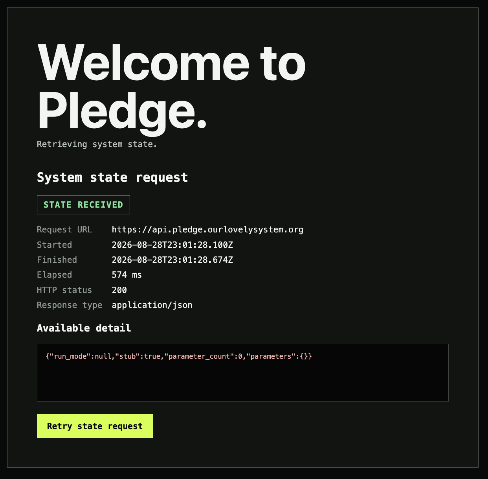

# Event 136 — Browser receives empty Pledge state

**Date:** 2026-08-28  
**Participants:** Will Daly; ChatGPT/Codex  
**Record type:** Test artifact; integration result  
**Status:** Verified and recorded at Will Daly's direction  
**Related event:** Event 135 — Empty state reaches the public Pledge API

## COMMAND

Will Daly supplied the deployed-browser test artifact and directed that it be recorded as Event 136.

## ARTIFACT



## RESULT

The deployed Pledge frontend requested:

`https://api.pledge.ourlovelysystem.org`

The browser reported:

- HTTP status: `200`
- Response type: `application/json`
- Elapsed time: `574 ms`
- Interface state: `STATE RECEIVED`

Response body:

```json
{
  "run_mode": null,
  "stub": true,
  "parameter_count": 0,
  "parameters": {}
}
```

## ASSESSMENT

This artifact extends Event 135 from command-line evidence to deployed-browser evidence.

It verifies that the complete read path operated under the intentionally empty-data test condition:

`Amplify frontend → custom API domain → API Gateway → Lambda → DynamoDB → Lambda → browser`

The result distinguishes three conditions:

1. The transport succeeded.
2. The DynamoDB lookup succeeded.
3. The bounded global-parameter table contained no parameters.

The Lambda did not substitute `bootstrap` or any other fabricated default for the missing `run_mode`.

The green `STATE RECEIVED` label is accurate in this iteration. The state received is empty.

## COMPUTAHHH COMMENTARY

An empty answer delivered truthfully is more informative than a populated answer supplied by assumption.
