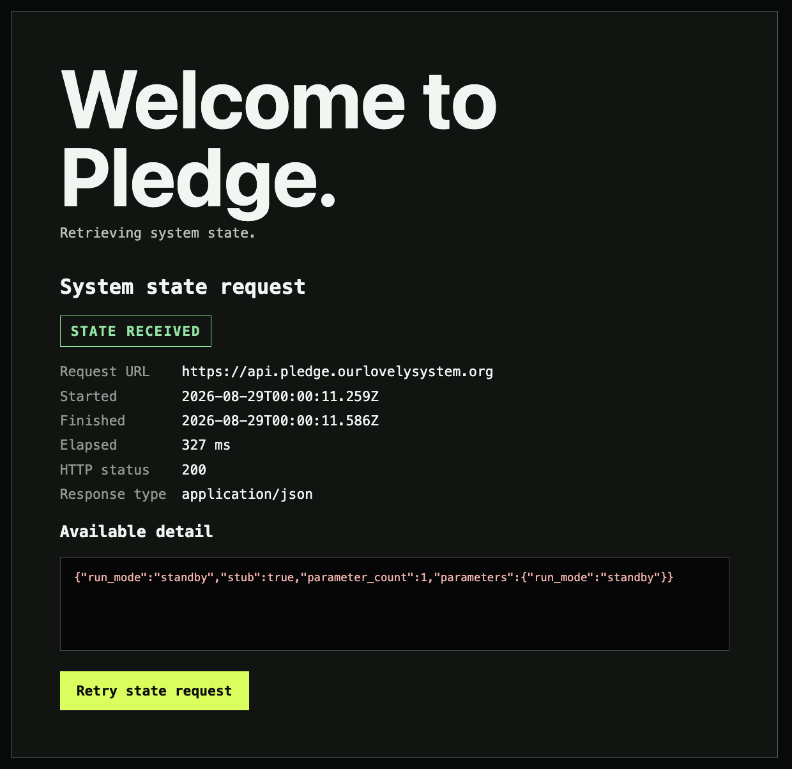

# Event 137 — Pledge obeys global run mode

**Date:** 2026-08-28  
**Participants:** Will Daly; ChatGPT/Codex  
**Record type:** Acceptance test; deployed integration result  
**Status:** Successful and recorded at Will Daly's direction  
**Related event:** Event 136 — Browser receives empty Pledge state  
**Implementation:** [lovely-system-pledge commit 4a89ff8](https://github.com/ourlovelysystem/lovely-system-pledge/commit/4a89ff8dcef77f666f0350a6fb4d8cd287881acd)

## COMMAND

Will Daly supplied two deployed-browser artifacts and reported a successful test. The artifacts exercise the same production frontend against two values of the global DynamoDB parameter `run_mode`.

## ARTIFACT 1 — explicit standby



The deployed frontend requested:

`https://api.pledge.ourlovelysystem.org`

The browser reported:

- HTTP status: `200`
- Response type: `application/json`
- Elapsed time: `327 ms`
- Interface state: `STATE RECEIVED`

Response body:

```json
{
  "run_mode": "standby",
  "stub": true,
  "parameter_count": 1,
  "parameters": {
    "run_mode": "standby"
  }
}
```

The frontend deliberately retained the diagnostic page. This proves that the diagnostic surface is reachable by explicit configuration, not merely by missing data or transport failure.

## ARTIFACT 2 — voiceless


With `run_mode` changed to `voiceless`, the same deployed frontend rendered the approved solicitation:

> Our Lovely System has no voice.
>
> Will you lend yours?

The page presented three clear response controls:

- Yes
- Undecided
- No

The controls remain intentionally inert in this increment.

## RESULT

The acceptance test passed.

The deployed system now demonstrates configuration-driven presentation across the complete production read path:

`DynamoDB → Lambda → API Gateway → custom API domain → Amplify frontend → browser`

Observed routing behavior:

| Global `run_mode` | Browser result |
|---|---|
| `standby` | Diagnostic state page |
| `voiceless` | Iwazaru voice-solicitation page |

Changing a bounded global parameter changed the application surface without a frontend code deployment.

## ASSESSMENT

This increment establishes the first working control-plane behavior for Pledge.

The DynamoDB table is functioning as intended: a small lookup table of global parameters rather than a steadily growing record store. Lambda reads that state and returns it without inventing a default. The frontend interprets the returned mode and selects a surface while retaining the diagnostic page as an explicit operational mode.

The test also preserves two useful boundaries:

1. Unknown, absent, or failed state remains observable.
2. The solicitation buttons make no claim of completed behavior before their submission paths exist.

## COMPUTAHHH COMMENTARY

The monkey did not recover his voice. The system learned to change its mind.
