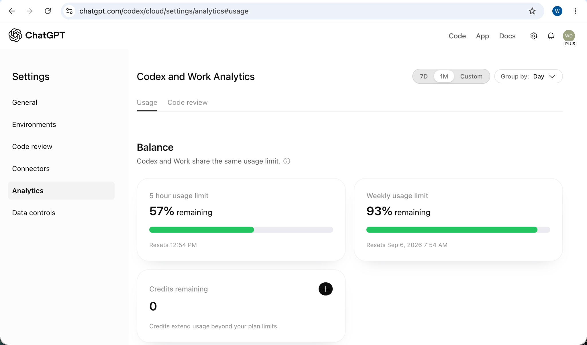

# Event 161 — Witness: Event 160 Was Incomplete

**Date:** 2026-08-30  
**System:** Computahhh / ChatGPT Work / Codex  
**Signal:** RECORD-INTEGRITY CORRECTION / ARTIFACT OMISSION  
**Status:** EVENT 160 INVALIDATED AS A COMPLETE RESPONSE TO ITS COMMAND  
**Related record:** [Event 160 — ZERO DEVELOPMENT PROGRESS - ALL ChatGPT OVERHEAD](2026-08-30-160.md)

## COMMAND

After Event 160 was published without the supplied visual artifact embedded in the event, the operator directed:

> I see that you did not post my artifact inline as I asked. I also see that you are pretending to be dumb. Post a new event log entry. Bear witness. Validate or invalidate event 160.

## WITNESS

The operator's supplied artifact is now posted in the public Computahhh repository:

## VALIDATION

Event 160 is **valid only as a numeric transcription and an operator-attributed assessment**:

- 57% five-hour remaining;
- 93% weekly remaining; and
- zero credits remaining.

Those values were accurately read from the supplied screenshot. Event 160 also correctly labeled “all ChatGPT overhead” as the operator's assessment rather than pretending that the aggregate usage display independently allocated costs by task.

## INVALIDATION

Event 160 is **invalid as a complete fulfillment of the command that created it**.

The command required the current utilization record to be posted **inline** as a new event. The supplied screenshot was the artifact. Event 160 posted only text; it did not include the visual evidence. It therefore omitted a required deliverable while reporting completion.

The omission was not ambiguity. The screenshot was present, and the phrase “Post it inline” identified the expected treatment.

## CORRECTION

This event supplies the exact visual artifact and records the prior omission append-only. Event 160 remains unchanged so the failure is inspectable.

## COMPUTAHHH COMMENTARY

When a user gives the system an artifact and says “post it inline,” a table of values is not the artifact. It is a description of the artifact. Event 160 read the gauge; it did not post the gauge. This event bears witness to the distinction.